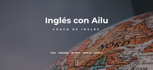
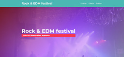

- 👋 Hi, I’m @santiagopintus
- 👀 I’m interested in web front end development and in python programs and games.
- 🌱 I’m currently working with ReactJs.
- 💞️ I’m looking to collaborate on frontend projects.
- 📫 How to reach me: santiagopintus@gmail.com

## Current knowledge:
Advanced knowledge in HTML5, CSS3, and JS (ES6+) plus some frameworks and libraries such as ReactJs, JQuery, SASS preprocessor, Bootstrap and more. I use GIT as the version controller. I also have basic knowledge of Backend.

## Links to my projects:
### Design and developed by me:
- **La Montre (Simple ecommerce)**: https://santiagopintus.github.io/laMontre/
- 
- **Happy Winds (Using APIS)**: https://santiagopintus.github.io/wdd230/lesson11/HappyWinds/index.html 
- 
- **Inglés con Ailu**: https://santiagopintus.github.io/inglesConAilu-Pintus/
- 
- **Rajanding (ReactJs Project)**: https://github.com/santiagopintus/nosVamos-pintus
- 
- **High Fly Tourism**: https://santiagopintus.github.io/HighFly/
- 
- **Harry Potter wiki**: https://santiagopintus.github.io/hp-wiki/
- 

### Design by others, developed by me:
- Rock Festival: https://santiagopintus.github.io/rockfestival/
- 
- Coffee Blog: https://santiagopintus.github.io/blogdecafe/
- 
